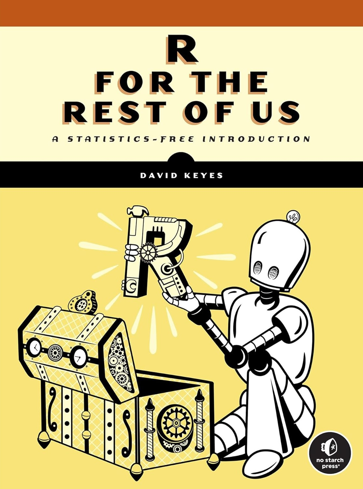

# R for the Rest of Us: A Statistics-Free Introduction

This repository holds the materials for the book *R for the Rest of Us: A Statistics-Free Introduction*, published by No Starch Press. [The book is available to read online](https://book.rfortherestofus.com).

## About the Book

The R programming language is a remarkably powerful tool for data analysis and visualization, but its steep learning curve can be intimidating for some. If you just want to automate repetitive tasks or visualize your data, without the need for complex math, R for the Rest of Us is for you.

Inside you’ll find a crash course in R, a quick tour of the RStudio programming environment, and a collection of real-word applications that you can put to use right away. You’ll learn how to create informative visualizations, streamline report generation, and develop interactive websites — whether you’re a seasoned R user or have never written a line of R code.

You’ll also learn how to:

- Manipulate, clean, and parse your data with `tidyverse` packages like `dplyr` and `tidyr` to make data science operations more user-friendly

- Create stunning and customized plots, graphs, and charts with `ggplot2` to effectively communicate your data insights

- Import geospatial data and write code to produce visually appealing maps automatically

- Generate dynamic reports, presentations, and interactive websites with R Markdown and Quarto that seamlessly integrate code, text, and graphics

- Develop custom functions and packages tailored to your specific needs, allowing you to extend R’s functionality and automate complex tasks

Unlock a treasure trove of techniques to transform the way you work. With R for the Rest of Us, you’ll discover the power of R to get stuff done. No advanced statistics degree required.

## About the Author

David Keyes is the founder and CEO of [R for the Rest of Us](https://rfortherestofus.com/), which offers online courses, workshops, and custom training sessions that help organizations take control of their data. He has a PhD in anthropology from UC San Diego, as well as a master's degree in education from Ohio State, and has dedicated his professional life to teaching people to embrace R as the most powerful tool for data analysis and visualization.

## Buy the Book

There will always be a free online version of this book. However, if you'd like to purchase a physical or electronic copy, you can do so directly from [No Starch Press](https://nostarch.com/r-rest-us), [Powell's](https://www.powells.com/book/r-for-the-rest-of-us-9781718503328), or [Amazon](https://a.co/d/fzAMxMV). 